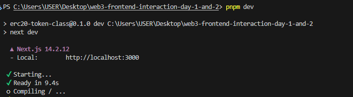

- This is a [Next.js](https://nextjs.org) project bootstrapped with [`create-next-app`](https://nextjs.org/docs/app/api-reference/cli/create-next-app).

- The package manager used in this project is `pnpm`

# Welcome to Web3 Frontend Interaction Repo

## Getting Started

if you have `pnpm` package manager already installed you can skip step one

1. Install `pnpm` with the following command in your terminal `npm install -g pnpm`

2. Change directory to the Web3 Frontend Interaction project and install necessary dependencies with `pnpm install`

3. After successful installation of dependencies we can now start our project with `pnpm dev`

You should see a picture similar to the one below

At this point, you have launched the project successfully 🎉🎉🎉

NOTE: For easy interaction, Install the Metamask extension or other related wallets